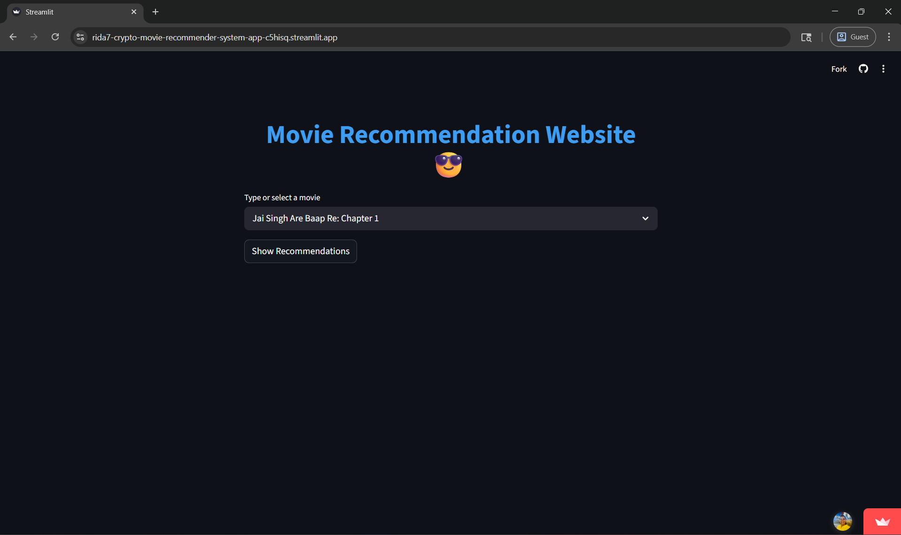
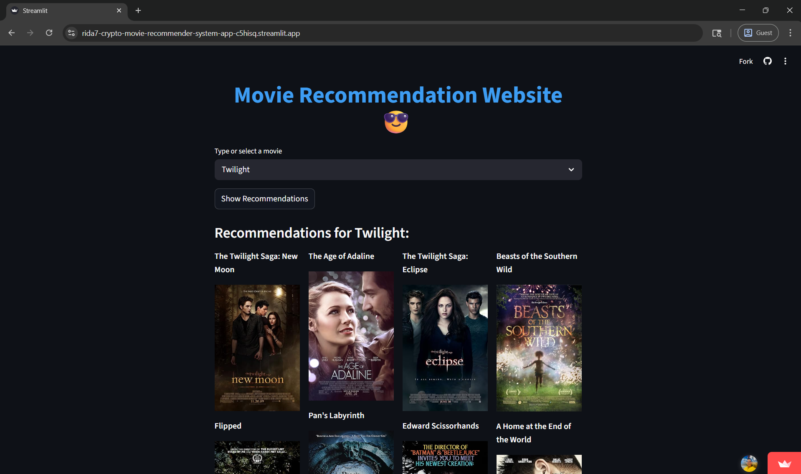

# 🎬 Movie Recommendation System

An interactive movie recommendation web app built with **Streamlit**, powered by similarity matrices and enriched with posters & IMDb links via the OMDb API.
---

## 📸 Screenshots

### Local Run (PyCharm)


### Deployed App (Streamlit)

---

## 🚀 Live Demo
Check out the deployed app here:  
👉 [Movie Recommendation Website](https://rida7-crypto-movie-recommender-system-app-c5hisq.streamlit.app/)

---

## 📂 Repository
GitHub repo: [rida7-crypto/movie-recommender-system](https://github.com/rida7-crypto/movie-recommender-system)

---

## 📊 Datasets Used
This project leverages publicly available movie metadata:

- [TMDb Movie Metadata](https://www.kaggle.com/datasets/tmdb/tmdb-movie-metadata)  
- [IMDb India Movies](https://www.kaggle.com/datasets/adrianmcmahon/imdb-india-movies)

Preprocessed `.pkl` files (movies dataframe and similarity matrix) are hosted on Kaggle and automatically downloaded at runtime using **kagglehub**.

---

## 🛠 Features
- Search or select a movie from the dropdown.
- Get top recommendations based on similarity scores.
- Posters and IMDb links fetched dynamically via OMDb API.
- Clean, recruiter‑ready Streamlit UI.

---

## 📦 Installation & Setup

### 1. Clone the repository
```bash
git clone https://github.com/rida7-crypto/movie-recommender-system.git
cd movie-recommender-system
```
### 2. Create a virtual environment (recommended)
```bash
python -m venv .venv
source .venv/bin/activate   # On Linux/Mac
.venv\Scripts\activate      # On Windows
```
### 3. Install dependencies
```bash
pip install -r requirements.txt
```
### 3. Run the app
```bash
streamlit run app.py
The app will automatically download the required dataset from Kaggle (public dataset) on first run
```

---

## 📑 Requirements
Dependencies are listed in `requirements.txt`:

```text
streamlit
pandas
requests
pickle-mixin
kagglehub
```
---

## 🌐 Deployment

This project is deployed on **Streamlit Community Cloud**.  
You can access the live app here:  
👉 [Movie Recommendation Website](https://rida7-crypto-movie-recommender-system-app-c5hisq.streamlit.app/)

### Steps to Deploy Your Own Version
1. Push your code to a GitHub repository.  
2. Go to [Streamlit Cloud](https://streamlit.io/cloud).  
3. Click **New App** and connect your GitHub account.  
4. Select your repository (`rida7-crypto/movie-recommender-system`), branch (`master`), and entry file (`app.py`).  
5. (Optional) Set a custom app URL if desired.  
6. Click **Deploy** — Streamlit will install dependencies from `requirements.txt` and run your app.  

> ⚡ Note: On first run, KaggleHub will download the dataset from Kaggle. This may take a few minutes, but subsequent runs will be faster since the dataset is cached.

---

## 🙌 Acknowledgements
- [OMDb API](https://www.omdbapi.com/) — for providing movie posters and IMDb links.  
- [Kaggle](https://www.kaggle.com/) — for hosting the datasets used in this project.  
- [TMDb Movie Metadata](https://www.kaggle.com/datasets/tmdb/tmdb-movie-metadata) — for global movie information.  
- [IMDb India Movies](https://www.kaggle.com/datasets/adrianmcmahon/imdb-india-movies) — for Indian movie metadata.  
- [Streamlit](https://streamlit.io/) — for the deployment platform and interactive UI framework.  

---
---

## 📧 Contact

Created by **Rida Tarique**  

- GitHub: [rida7-crypto](https://github.com/rida7-crypto)  
- LinkedIn: [Rida Tarique](https://www.linkedin.com/in/rida-tarique/)  

Feel free to reach out for collaboration, feedback, or opportunities!
